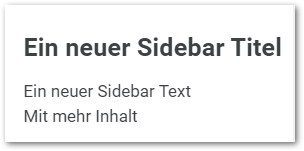
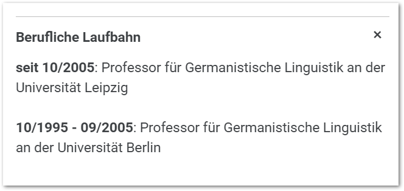
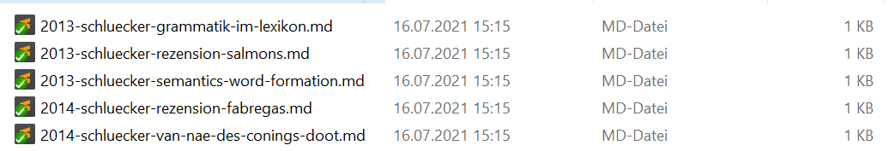
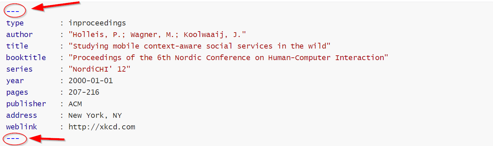
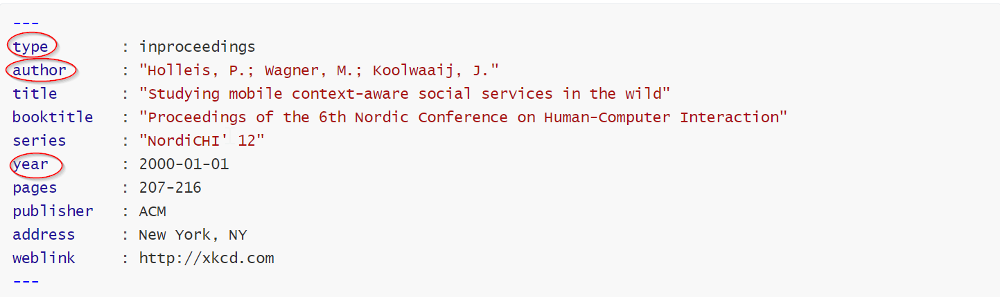
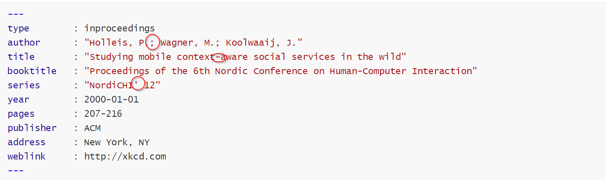
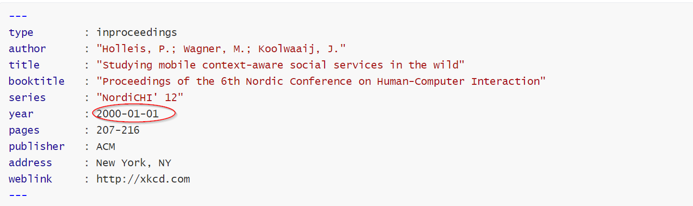
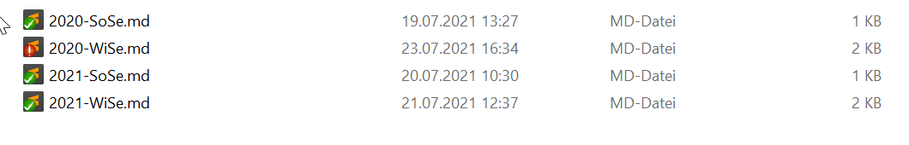
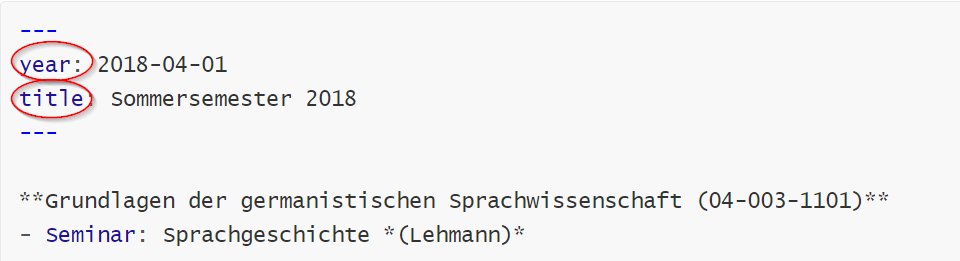

## Grammatik des Deutschen Content Creation

Folgende Inhalte können produziert und modifiziert werden:

| Inhalte         | web url           | source code location | Jekyll Typ |
| --------------- | ----------------- | -------------------- | ---------- |
| Posts           | /                 | _posts               | Post       |
| Team Mitglieder | /team             | _team                | Collection |
| Publikationen   | /publikationen    | _publicationen       | Collection |
| Lehraktivitäten | /lehraktivitaeten | _lehraktivitaeten    | Collection |
| Kontakt         | /kontakt          | _pages/kontakt.md    | Page       |


## Team Mitglieder

Einträge für Team Mitglieder werden hier publiziert:

```
https://home.uni-leipzig.de/grammatik-des-deutschen/team/
```

Im Source Code ist der Seiteneintrag hier zu finden:

```
_pages/team.md
```

Alle Einträge von Team Mitgliedern werden automatisch für die Team Seite von Jekyll generiert.

Es sind also keine Veränderungen an `team.md` vorzunehmen. 


### 

<div style="text-align:center">Bild: Beispiel von Team Mitgliedern</div>

### Wie füge ich neue Teammitglieder hinzu?

Um neue Teammitglieder zu erstellen müssen neue Markdowndateien in der Kollektion  `_team` angelegt werden.

Bei der Namensgebung von neuen Dateien bitte folgendes beachten:

- Es dürfen keine Umlaute benutzt werden.
- Es werden keine Großbuchstaben genutzt.
- Für Leerzeichen wird `Kebab Case` genutzt (zb Max Friedrich Mustermann → max-friedrich-mustermann.md)


<div style="text-align:center">Bild: Anlegen neues Teammitglied im _team Ordner</div>

#### Basisinformationen

```yaml
---
title       : Max Mustermann
last_name   : Mustermann
excerpt     : Max Mustermann is a hard worker.
---
```

- Für title wird der volle Name des Teammitglieds angegeben
- Der Nachname muss separat unter `last_name` definiert werden (dies ist wichtig für die Darstellung der Publikationen)
- Der Eintrag  `excerpt` wird auf der Team Seite als Teaser Text angezeigt. Dieser Eintrag ist optional. Falls nicht definiert, nimmt Jekyll einen Auszug aus dem ersten Paragraphen der Markdown Datei. Falls es keinen Text gibt, bleibt das Feld leer.


<div style="text-align:center">Bild: Neues Teammitglied in Seitenansich "Team"</div>

1. Entspricht dem Eintrag `title` 
2. Entspricht dem Eintrag `excerpt`
3. Ein Default Teaser wird angezeigt, wenn kein Bild definiert wurde.

#### Teaser Image

Für die Team Seite kann ein Teaser Bild definiert werden

```yaml
header:
  teaser: /assets/images/team/david-bowie-teaser.jpg
```

Es wird empfohlen das Bild im Projekt Ordner hier abzulegen:

```
assets/images/team
```


<div style="text-align:center">Bild: Max Mustermann Teaser Eintrag</div>

Achtung: Das Bild wird von Jekyll automatisch abgeschnitten, falls es nicht im Querformat angelegt ist.

Es bietet sich an, das Bild entsprechend zu formatieren. Wahlweise kann auch manuell ein weißer Hintergrund eingefügt werden, um das Abschneiden zu verhindern.


<div style="text-align:center">Bild: Teaser Bild mit weißem Hintergrund</div>

#### Markdowntext

Unterhalb der Front Matter Definitionen `---` kann nun Fließtext in Markdown gesetzt werden:

```markdown
## Beschreibung
Mustermann ist ein häufig verwendeter Familienname fiktiver Personen in Deutschland. Erika Mustermann und Max Mustermann stehen als Platzhalternamen für eine beliebige (reale) Frau und einen beliebigen (realen) Mann. Sie werden seit 1978 in Mustern, Vorlagen und Ausfüllhilfen, Formularen, Hinweisen und Datenbanken verwendet.

## Max Mustermann
Max Mustermann hat im deutschen Sprachgebrauch die Nachfolge von Otto Normalverbraucher als fiktive Person und Inbegriff des Durchschnittsdeutschen angetreten. 
Beachte
- Er ist ein Verwandter, nach üblicher Annahme der Ehemann der wesentlich bekannteren, ebenfalls fiktiven Erika Mustermann, die mit Foto und Lebensdaten viele Musterausweise und Dokumente ziert. 
- Ausweisdokumente auf den Namen Max Mustermann sind wesentlich weniger verbreitet
- Das Kraftfahrt-Bundesamt veröffentlichte ein Muster der 2006 eingeführten EG-Fahrerkarte mit dem Bild eines am 1. Februar 1976 geborenen Max Mustermann, ausgestellt von der Fahrerlaubnisbehörde Musterstadt.
```

Dieser wird automatisch ins Layout der Detail Seite des Teammitglieds eingebettet:


<div style="text-align:center">Bild: Max Mustermann Detail Seite</div>

#### Sidebar Inhalte

Für die Detailseite von Teammitgliedern können in der Front Matter Inhalte für eine Sidebar definiert werden.

Für den ersten Paragraphen ist ein Bild mit Position reserviert. Diese sind wie folgt definiert:

```yaml
---
sidebar:
- title		: Position
  image		: /assets/images/team/david-bowie.jpg
  text		: "Wissenschafterlicher Musterarbeiter"
---
```

Achtung: `sidebar:` darf nur einmal definiert werden! 

Alle Weiteren Einträge werden unter `sidebar: `entsprechend eingerückt.

Es wird empfohlen das Bild im Projekt Ordner hier abzulegen:

```
assets/images/team
```


<div style="text-align:center">Bild: Max Mustermann Bild und Position</div>

Weiterhin können Links für zb Email, Webseite und Social Sites definiert werden:

```yaml
- label	: "Email Kontakt"
  icon	: "fas fa-fw fa-envelope-square"
  url	: "mailto:maxmustermanns@gmail.com"
```


<div style="text-align:center">Bild: Max Mustermann Bild und Position</div>

Es können beliebig viele Links definiert werden. Die folgenden Definitionen für `icon` stehen zur Verfügung:

```yaml
# Email Icon
icon	: "fas fa-fw fa-envelope-square"
# Instagram Icon
icon	: "fab fa-fw fa-instagram"
# Website Icon
icon	: "fas fa-fw fa-link"
# Github Icon
icon	: "fab fa-fw fa-github"
# Facebook Icon
icon	: "fab fa-fw fa-facebook-square"
# Twitter Icon
icon	: "fab fa-fw fa-twitter-square"
```


Label können hierbei beliebig erweitert werden. Zb so:

```yaml
- title: Ein neuer Sidebar Titel
  text: Ein neuer Sidebar Text <br> Mit mehr Inhalt
```



<div style="text-align:center">Bild: Max Mustermann Sidebar Erweiterung</div>

#### Akkordion Inhalte

Es können Akkordion Inhalte für die Detailseite von Teammitgliedern über die Front Matter definiert werden.

```yaml
accordion:
- title     : Berufliche Laufbahn
  subitems:
  - label   : "seit 10/2005"
    content : "Professor für Germanistische Linguistik an der Universität Leipzig"
  - label   : "10/1995 - 09/2005"
    content : "Professorin für Germanistische Linguistik an der Universität Berlin"
```

Hierbei gilt:

- Achtung: `accordion:` darf nur einmal definiert werden! 

  Alle Weiteren Einträge werden unter `accordion: `entsprechend eingerückt.

- Jedes Akkordion benötigt einen `title:` tag. Es können beliebig viele definiert werden.

- Für jedes Akkordion müssen `subitems:` definiert werden.

- Jedes subitem folgt immer der Syntax `label:` und `content:`



<div style="text-align:center">Bild: Akkordion Beispiel</div>

Weiterhin kann der Akkordion Typ "Publikationen" wie folgt definiert werden:

```yaml
- title: Publikationen
```

Hier müssen keine subitems definiert werden. Jekyll wird das Akkordion automatisch aus der Kollektion `publikationen` befüllen. 

Hierbei ist es wichtig, dass `last_name` für das Teammitglied definiert wurde (diese Definition wird als Suchterm für die Kollektion übernommen).


#### Beispiel Teammitglied

Hier ist eine fertige Front Matter Definition für ein Teammitglied:

```yaml
---
# Basics
title       : Max Mustermann
name        : Max Mustermann
last_name   : Mustermann
excerpt     : Max Mustermann is a hard worker.

# Teaser Image
header:
  teaser: /assets/images/team/david-bowie-teaser.jpg

# Accordion Content
accordion:
- title     : Berufliche Laufbahn
  subitems:
  - label   : "seit 10/2005"
    content : "Professor für Germanistische Linguistik an der Universität Leipzig"
  - label   : "10/1995 - 09/2005"
    content : "Professor für Germanistische Linguistik an der Universität Berlin"
- title     : Publikationen    

# Sidebar
sidebar:
- title     : "Position"
  image     : /assets/images/team/david-bowie.jpg
  text      : "Wissenschafterlicher Musterarbeiter"
- label     : "Email Kontakt"
  icon      : "fas fa-fw fa-envelope-square"
  url       : mailto:maxmustermanns@gmail.com
- label     : "Website besuchen"
  icon      : "fas fa-fw fa-link"
  url       : "https://your-website.com"
- label     : "Auf Twitter folgen"
  icon      : "fab fa-fw fa-twitter-square"
  url       : "https://twitter.com/mustermann"  
- title     : "Sprechzeiten"
  text      : "Dienstag 13:30 – 14:30 Uhr <br> Vereinbarung per E-Mail"
- title     : "Anschrift"
  text      : "Germanistische Linguistik <br> GWZ <br> Beethovenstraße 15, Raum 1412 <br> 04107 Leipzig"
---
```

Die obige Front Matter produziert die folgenden Inhalt für das Team Mitglied "Max Mustermann"


<div style="text-align:center">Bild: Max Mustermann Detail Seite</div>

## Wie lege ich Publikationen an?

#### Basisinformationen

Um Publikationen zu erstellen müssen neue Markdowndateien in der Kollektion  `_publikationen` angelegt werden. Jede Publikation benötigt eine eigene Datei.

Bei der Namensgebung von neuen Dateien bitte folgendes beachten:

- Es dürfen keine Umlaute benutzt werden.
- Es werden keine Großbuchstaben genutzt.
- Für Leerzeichen wird `Kebab Case` genutzt *(Trennung durch Bindestriche)*
- Dateinamen folgen dem Muster: Jahr der Veröffentlichung, Autor, Titel (in Kurzform) (z.B. 2013-mustermann-syntax-des-deutschen).





#### Arten von Publikationen

Es gibt verschiedene 4 Arten von Publikationen, die angelegt werden können:

##### book

 *book* für **Monographien** oder Herausgeberschaften

```yaml
---
type      : book
author    : Susskind L.; Hrabovsky G.
title     : "Classical mechanics: the theoretical minimum"
publisher : Penguin Random House
address   : New York, NY
year      : 2000-01-01
isbn      : 9780141976228
weblink   : https://www.amazon.de/Classical-Mechanics-Theoretical-Minimum/dp/0141976225
---

```


 *book* für Monographien oder **Herausgeberschaften**

```yaml
---
type      : book
author    : Susskind L.(Hrsg.)
title     : "Classical mechanics: the theoretical minimum"
publisher : Penguin Random House
address   : New York, NY
year      : 2000-01-01
isbn      : 9780141976228
weblink   : https://www.amazon.de/Classical-Mechanics-Theoretical-Minimum/dp/0141976225
---

```


##### article

*article* für Veröffentlichungen in Zeitschriften

```yaml
---
type        : article   
author      : Mustermann M.
title       : The independence of the continuum hypothesis
journal     : Proceedings of the National Academy of Sciences
volume      : 42
number      : 3
pages       : 122-211
year        : 2000-01-01
doi         : 10.1016/j.ipm.2015.08.003
weblink     : https://www.sciencedirect.com/science/article/pii/S0306457315001041
---

This is an example of a paper.
The doi flag and weblink flag are optional.
If either one is defined, then a link will be generated.
```


##### inbook

*inbook* für Veröffentlichungen in Sammelbänden

```yaml
---
type        : inbook
author      : "Mustermann M.; Bowie D."
title       : "Chapter 1: Photosynthesis"
booktitle   : Campbell Biology
year        : 2000-01-01
publisher   : Acme Publishing House
address     : Musterhausen
pages       : 120-130 
doi         : 10.1016/j.ipm.2015.08.003
---
```

##### conference

*conference* für Veröffentlichungen von Konferenzbeiträgen

```yaml
---
type        : inproceedings
author      : "Holleis, P.; Wagner, M.; Koolwaaij, J."
title       : "Studying mobile context-aware social services in the wild"
booktitle   : "Proceedings of the 6th Nordic Conference on Human-Computer Interaction"
series      : "NordiCHI' 12"
year        : 2000-01-01
pages       : 207-216
publisher   : ACM
address     : New York, NY
weblink     : http://xkcd.com
---

This is an example of a paper from a conference.
The doi flag and weblink flag are optional.
If either one is defined, then a link will be generated.
```


#### Wichtige Hinweise

- Der gesamte Eintrag muss oben und unter zwischen 3 Bindestrichen stehen.




- Die flags *type*, *author* und *year* sind relevant für die spätere automatische Sortierung und sind obligatorisch.




- Falls sich im Text (*außer weblink*) Sonderzeichen befinden sollten (z.B.: Doppelpunkte, Anführungszeichen (einfach und doppelt), Semikolons o.Ä.) muss der Text in Anführungszeichen gesetzt werden, da es sonst zu Problemen bei der Darstellung im Frontmatter kommen kann.




- *year* erfordert ein vollständiges Datum stehen im Format (jjjj-mm-tt). Dabei ist jedoch nur das Jahr relevant.




## Wie lege ich Lehraktivitäten an?

#### Basisinformationen

Um Lehraktivitäten zu erstellen müssen neue Markdowndateien in der Kollektion  `_lehraktivitaeten` angelegt werden. Jedes Semester benötigt eine eigene Datei.

Bei der Namensgebung von neuen Dateien bitte folgendes beachten:

- Es dürfen keine Umlaute benutzt werden.
- Es werden keine Großbuchstaben genutzt.
- Für Leerzeichen wird `Kebab Case` genutzt *(Trennung durch Bindestriche)*
- Dateinamen folgen dem Muster: **Jahr** und **Semester**. (Wintersemester werden nur mit einer Jahreszahl an dieser Stelle versehen.
  - Bsp: WiSe 2019/20 bekommt als Dateinamen 2020)



#### Semester anlegen

Im Frontmatter müssen *year* und *title* definiert werden.

Nach *year* muss ein vollständiges Datum stehen im Format jjjj-mm-tt. 

Für das WiSe wird den 01.10. und für die SoSe der 01.04. verwendet.




Die Lehrveranstaltungen werden unter dem Frontmatter nach dem folgenden Schema gelistet:

**Name des Moduls (Modulnummer)**

\- Veranstaltungsart: Name der Veranstaltung *(Name des Dozierenden)*


```yaml
---
year: 2018-04-01
title: Sommersemester 2018
---

**Grundlagen der germanistischen Sprachwissenschaft (04-003-1101)**
- Seminar: Sprachgeschichte *(Lehmann)*

**System der deutschen Sprache (04-003-1103)**
- Seminar: Phonetik und Phonologie *(Forche)*
- Seminar: Semantik *(Schlücker)*

**Ausgewählte Aspekte und Probleme des Sprachsystems des Deutschen (04-003-1108)**
- Vorlesung: Wortbildung *(Schlücker)*

**Aspekte sprachwissenschaftlicher Forschung 1 (04-003-2001)**
- Seminar: Probleme syntaktischer Kategorisierung *(Döring)*

**Grammatische Grundlagen (04-003-2003)**
- Seminar & Übung: Kritische Auseinandersetzung mit der Schulgrammatik/Schulgrammatische Übung *(Lehmann)*

**Aspekte sprachwissenschaftlicher Forschung 3 (04-003-2007)**
- Seminar: Wortbildungsmorphologie *(Frankowsky)*

**Grammatik und Lexikon (04-040-2002)**
- Vorlesung: Phraseologie *(Schlücker)*
- Kolloquium: Phraseologie *(Schlücker)*
- Seminar: Die Nominalphrase in den germanischen Sprachen *(Schlücker)*

**Geschichte der deutschen Sprache (Teil 1) (04-003-WBSS-1)**
- Seminar: Sprachgeschichte *(Lehmann)*
```

